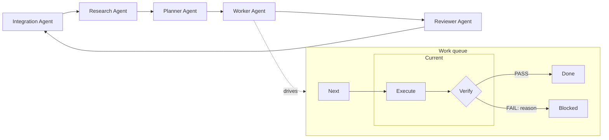

# 🌾 Nai — Naive Agentic Infrastructure

A 2026-style delivery workflow for AI coding agents, tightly integrated
with git through an extensible Integration Agent role. It is not a
framework you import and not a CLI you install —
it is a small set of markdown prompts and scripts that an AI agent
scaffolds into your project, and that you then drive yourself.

It works on any repository: a greenfield prototype, a long-lived
monorepo, or several unrelated repos pulled into one workspace.

---

## 🚀 Install

In an empty directory, open any AI coding agent (Claude Code, opencode,
Codex, Copilot Chat, …) and send one message:

> Please read <https://raw.githubusercontent.com/piontkovsk11andre1/nai/main/INSTALL.md>
> and implement the workflow.

That agent acts as a **scaffolder**: it asks a few questions (natural
language, OS, scripting language, AI harness) and produces the files.
The directory it leaves behind is a self-contained, portable
distributive pinned to your platform and harness — copy it to another
machine and it works as-is.

The first time you open the top-level launcher it runs a one-off
**Installation Agent** that wires up your actual repos and naming
conventions, asks about any add-ons or tweaks you want, and then
rewrites the launcher to open the day-to-day **Workspace Agent** from
then on.

After that, just open the top-level launcher again and ask the
**Workspace Agent** to walk you through the workflow — it will show
you how to create a workspace, where each role plugs in, and what
ends up in every file.

---

## 🔄 How the workflow looks



Five roles, each a separate AI session with its own prompt and a small
set of input/output files. You move between them at your own pace;
nothing is automatic across role boundaries.

The flow is deliberately minimal. As models keep getting smarter, the
scaffolding around them can shrink — Nai keeps only the few guardrails
that still matter:

- **Just enough checkpoints.** Each role is a context reset that keeps
  the agent focused on the step in front of it instead of drifting
  into future ones.
- **Order is enforced.** Role boundaries mean Research can't start
  coding and Worker can't replan.
- **Right model for each job.** Pick a different model per role and
  per task type — a cheap fast one for Execute, a stricter one for
  Verify, a long-context one for Planner.
- **Early verification.** Every chunk is checked the moment it lands,
  so a mistake gets caught before it tangles with the next three.

---

## 📦 What you actually get

A directory like this, generated on first install:

```
Open Agent.(cmd|command|desktop)   top-level launcher
Prompts/
  Installation Agent.md
  Workspace Agent.md
Scripts/
  Agent.<ext>                       dispatcher
  Workspace - Create.<ext>
  Workspace - Remove.<ext>
  Work - Do.<ext>
  Work - Undo.<ext>
  WorkflowLog.<ext>                 shared logging utility
  Workers/Default.<ext>             AI harness wrapper
Workspaces/
  Backlog.md                        global backlog (Integration Agent syncs into)
  Changelog.md                      global changelog (Integration Agent syncs into)
  __template__/                     copied for every new workspace
    1. Open Integration Agent.<launcher>    per-agent launchers
    2. Open Research Agent.<launcher>
    3. Open Planner Agent.<launcher>
    4. Open Worker Agent.<launcher>
    5. Open Reviewer Agent.<launcher>
    Workspace.md                    structure, naming, branch conventions
    Assignments.md                  worker preference notes
    Backlog.md                      per-workspace backlog
    Changelog.md                    per-workspace changelog
    Facts.md                        durable confirmed facts (append-only)
    Framework.md                    navigation map + build/test/run/verify
    Issue.md                        structured task capture
    Notes.md                        free-form notes
    Plan.md                         plan, risks, verification strategy
    PR.md                           pull request draft
    Research.md                     research log (edited in place)
    Status.md                       Part/Expected/Current/% table
    Prompts/                        per-workspace agent prompts
      Integration Agent.md
      Research Agent.md
      Planner Agent.md
      Worker Agent.md
      Reviewer Agent.md
      Work - Execute.md
      Work - Verify.md
    Work/                           markdown-backed task queue
      Next.md
      Current.md
      Blocked.md
      Done.md
  __archive__/                      finished workspaces land here
```

Each new workspace (one per ticket / feature / experiment) is a copy of
`__template__` with git worktrees attached for the repos you work on,
plus its own prompts, plan, status, work queue, and a durable
`Facts.md` that captures confirmed project facts across tasks.

---

## ▶️ How you run it

You have several equally valid entry points, pick whichever fits:

- **Double-click a launcher.** A tactile, OS-native entry point into any
  individual role: each workspace ships five launchers (Integration / Research
  / Planner / Worker / Reviewer) as launcher files (`.cmd` on Windows,
  `.command` on macOS, `.desktop` on Linux), so they sit in Explorer /
  Finder / your file manager and integrate with the OS UI like any
  other app — pin them to the taskbar, drop them in the Dock, put them
  on the desktop. Double-clicking opens that role's session directly,
  no orchestrator in between.
- **From your editor.** Ask an AI agent to integrate Nai with your
  editor (VS Code, JetBrains, Zed, whatever) — it knows the layout and
  will pick a sensible way to surface every knob (tasks, run configs,
  status bar buttons, a side panel, …) for the editor you use.
- **From a pipeline.** Every entry point under `Scripts/` is
  non-interactive by design — including the agent dispatcher itself.
  `Scripts/Agent --prompt <path/to/role-prompt.md> --workspace <ws> --mode cli`
  runs any of the five roles unattended (the harness is invoked in its
  non-interactive mode: `opencode run`, `claude -p`, etc.) and returns
  an exit code. Missing a decision flag on any script exits non-zero
  with a message naming the exact flag. The whole surface drops
  cleanly into Make targets, CI jobs, git hooks, or any other
  automation.
- **From the top-level Workspace Agent.** Stay in one session and let
  it open the others for you — it can spawn a Research / Planner /
  Worker / Reviewer session for any workspace, hand the task over, and
  come back to its own prompt. If the orchestrating session drifts,
  restart just that one and pick up where you left off; the per-role
  sessions it spawned keep their own state.

That clickable role-by-role entry is intentional: it disciplines you to
use the stages as control and confirmation points, so **your** own mistakes
get caught early. If you let AI blur the steps together without your
review and correction, the work can drift away from the target.

---

## ✨ Why bother

A few things that make this different from "just prompting an agent":

- **Hard execute/verify loop.** Verification is a separate session with
  its own prompt that must emit `PASS` or `FAIL: <reason>` as its last
  line. Anything else is treated as blocked, with the reason recorded
  in `Work/Blocked.md`.
- **Git-synchronized rollback.** Before each chunk runs, the `HEAD` of
  every repo in the workspace is recorded into a header attached to the
  chunk. Ask the Worker (or Integration) Agent to undo the last N steps and it
  resets every affected repo back to its captured state and puts the
  chunks back on the queue. You can let an agent try aggressive changes
  and roll the whole thing back with one request.
- **A planning surface that stays useful.** `Status.md` is a simple
  table (Part / Expected / Current / Completion % / Last Checked) the
  Planner and Reviewer keep current; any row below 100% feeds the next
  planning pass.
- **Durable facts across tasks.** The Planner's interview appends
  confirmed answers (project conventions, decisions, environment
  specifics) as `## <Title>` sections to `Facts.md`. Agents grep that
  file on demand instead of re-asking the same questions in the next
  task. The Workspace Agent can later merge facts from every live
  workspace into the template and push the merged file back into each
  live workspace; archived workspaces are left untouched.
- **Workspace isolation via git worktrees.** Multiple workspaces can
  point at the same repos on different branches without stepping on
  each other.
- **Archive, don't delete.** Workspaces are never wiped — when you tell
  the Integration Agent you are done, it syncs the workspace's backlog /
  changelog upstream and moves the whole workspace into `__archive__/`.
- **No remote pushes unless you ask.** The scripts never push.

---

## 🔧 What you can change

- **Prompts.** Every agent's behavior lives in a markdown file under
  `Workspaces/__template__/Prompts/`. Edit them in the template to
  affect every new workspace, or inside a specific workspace for one-off
  tweaks.
- **Workers.** Drop a new script next to `Scripts/Workers/Default` and
  pass `--worker <name>` to switch harnesses. Since the worker is just
  a script in your program, it can call any API over any protocol —
  local CLI, remote model, HTTP service, whatever you wire up.
- **Status / backlog / changelog formats.** These are plain markdown
  used by agents, not parsed by scripts — change the shape if it
  doesn't fit.
- **Natural language, OS, scripting language, harness.** All chosen at
  install time; the same prompts and contracts work for any
  combination.
- **Anything else.** When the Installation Agent runs from the top-level
  launcher it asks for add-ons, tweaks, or free-form comments before
  finalizing the install — that is the moment to extend Nai with extra
  roles, scripts, or conventions, or to strip out features you do not
  want.

---

## 🧪 Try it on an existing repo

Pick a project you are already working on and try a single round-trip:

1. Install (or copy) Nai into a fresh directory next to (not inside) the repo,
   and let the Installation Agent attach the repo to the template.
2. Create a workspace for one small, reversible task. Either point the
   Workspace Agent at your issue tracker, or just ask to write the task into
   `Issue.md`.
3. Ask the Workspace Agent to run Research, Planner, and Worker in turn —
   each role already knows what to do. After review and any follow-up
   passes to drive `Status.md` to 100%, look at the diff, `PR.md`, and
   `Changelog.md`, and decide whether the workflow is worth keeping.

---

## 📚 More

The full specification (per-file contracts, per-script behavior,
launcher recipes, harness guide, verification checklist) lives in
[INSTALL.md](INSTALL.md). This README only describes what you live with
day to day.

[MIT](LICENSE) licensed.
