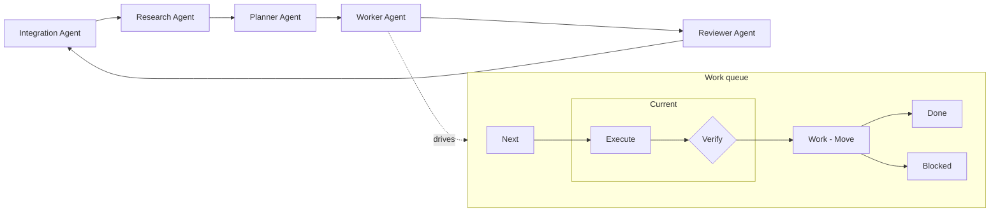

# 🌾 Nai — Naive Agentic Infrastructure

A 2026-style delivery workflow for AI coding agents, tightly integrated
with git through an extensible Integration Agent role. It is not a
framework you import and not a CLI you install — it is a small set of
markdown prompts and scripts that an AI agent scaffolds into your project,
and that you then use through role-based agent sessions.

It works on any repository: a greenfield prototype, a long-lived monorepo,
or several unrelated repos pulled into one workspace. And because the
installer is a specification rather than a binary, the same workflow
materializes in your language, on your OS, in your scripting language, for
your AI harness.

`Installation.md` is the machine-readable source of truth for the install. A
small deterministic runtime owns workflow state, recovery, health checks, and
safe relocation; agents stay focused on planning, repository work, and review.
Every generated artifact is inventoried against the exact specification that
created it, so a later repair can restore generated pieces without treating your
work as scaffolding.

---

## 🚀 Install

In an empty directory, open any AI coding agent (Claude Code, opencode,
Codex, Copilot Chat, ...) and give it the exact `INSTALL.md` bytes from this
repository:

> Read `INSTALL.md` and implement the workflow in this directory.

That agent acts as a **scaffolder**: it asks a few questions (natural
language, OS, scripting language, AI harness) and produces the files. The
directory it leaves behind is a self-contained distribution pinned to your
platform, harness, and exact specification digest. Those choices and the
generated artifact inventory are recorded in `Installation.md`.

Moved the directory to another path? Nai can relink itself to the new root.
Suspect something drifted — a deleted launcher, a stale lock, or interrupted
work? Nai can audit itself and apply safe repairs.

Running the same exact specification against an existing Nai root is a
**repair**, not a fresh install: it regenerates only eligible missing or drifted
generated content and preserves workspaces, repositories, facts, and user-owned
files.

The fresh scaffold creates `Installation.md` in `pending` state. The first time
you open the top-level launcher it starts the **Installation Agent**, which
confirms harnesses, reusable repository sources, naming conventions, and the
customizations you want. After validation and your confirmation, the runtime
marks the installation `complete`; the same static launcher then opens the
day-to-day **Workspace Agent**. Selection is based on validated installation
status and recovery evidence, never merely on whether a file exists.

After that, just open the top-level launcher again and ask the **Workspace
Agent** to walk you through the workflow — it will show you how to create a
workspace, where each role plugs in, and what ends up in every file.

---

## 🔄 How the workflow looks



Five roles, each with its own prompt and a small set of input/output files.
You can move between roles either by opening launchers (separate sessions)
or by switching in-chat inside a per-workspace session ("switch to planner",
"become reviewer"). If you ask a role to do something outside its scope, it
offers a same-session switch to a better-fit role.

The flow is deliberately minimal. As models keep getting smarter, the
scaffolding around them can shrink — Nai keeps only the few guardrails that
still matter:

- **Just enough checkpoints.** Each role is an explicit focus boundary.
  Switch in-chat when convenient, or open a fresh role window for a hard
  context reset.
- **Order is enforced.** Role boundaries mean Research can't start coding
  and Worker can't replan.
- **Right model for each job.** Pick a different model per role and per task
  type — a cheap fast one for Execute, a stricter one for Verify, a
  long-context one for Planner.
- **Early verification.** Every task is checked the moment it lands, so a
  mistake gets caught before it tangles with the next three.

---

## 📦 What you actually get

A directory like this, generated on first install:

```
Open Agent.(cmd|command|desktop)   top-level launcher (static, status-gated)
Installation.md                    machine-readable install record
.nai/                              state, locks, operations, journals, scratch
Prompts/
  Installation Agent.md
  Workspace Agent.md
Scripts/
  Workflow.<ext>                   canonical runtime and orchestration
  Dispatcher.<ext>                 dispatcher
  Policy.<ext>                     shared runtime file policy + locks
  Workspace - Create.<ext>
  Workspace - Remove.<ext>
  Work - Do.<ext>
  Work - Move.<ext>
  Work - Undo.<ext>
  Logger.<ext>                     shared logging utility
  Workers/
    Default.<ext>                  AI harness wrapper (capability-descriptor driven)
Workspaces/
  Backlog.md                       global backlog (append-only sync under workflow-root lock)
  Changelog.md                     global changelog (append-only sync under workflow-root lock)
  __template__/                    copied for every new workspace
    Scripts/
      Workflow.<ext>               workspace-local shim to the root runtime
    1. Open Integration Agent.<launcher-ext>    per-agent launchers
    2. Open Research Agent.<launcher-ext>
    3. Open Planner Agent.<launcher-ext>
    4. Open Worker Agent.<launcher-ext>
    5. Open Reviewer Agent.<launcher-ext>
    Workspace.md                   workspace identity and current run
    Assignments.md                 worker preference notes
    Backlog.md                     per-workspace backlog
    Changelog.md                   per-workspace changelog
    Facts.md                       durable confirmed facts (append-only, timestamped, corrections)
    Framework.md                   navigation map + build/test/run/verify
    Issue.md                       structured task capture
    Notes.md                       free-form notes
    Plan.md                        plan, risks, verification strategy
    PR.md                          pull request draft
    Research.md                    question-driven research log
    Status.md                      Part/Expected/Current/% table
    .nai/
      State.md
      Locks/
      Operations/
      Transactions/
      Scratch/
    Prompts/                       per-workspace agent prompts
      Integration Agent.md
      Research Agent.md
      Planner Agent.md
      Worker Agent.md
      Reviewer Agent.md
      Work - Execute.md
      Work - Verify.md
    Work/                          file-backed task queue
      Next/
      Current/
      Blocked/
      Done/
  __archive__/                     finished workspaces land here
```

Each new workspace (one per ticket / feature / experiment) begins as a Git-free
coordination space. Integration then sets up and registers the repositories the
work actually needs, using worktrees, clones, new repositories, existing
checkouts, or no repository at all. The workspace keeps its own shim, prompts,
plan, status, work queue, and durable `Facts.md`.

---

## ▶️ How you run it

You run Nai by talking to agents, not by memorizing commands. The common
entry points are:

- **Double-click a launcher.** A tactile, OS-native entry into any role:
  each workspace ships five launchers (`.cmd` on Windows, `.command` on
  macOS, `.desktop` on Linux) that sit in Explorer / Finder / your file
  manager like any other app — pin them, dock them, desktop them.
  Double-clicking opens a conversational role session. Mutating work routes
  through the Workspace Agent so prerequisites and run authority are checked.
- **From your editor.** Ask an AI agent to integrate Nai with your editor
  (VS Code, JetBrains, Zed, …) — it knows the layout and will surface every
  knob for the editor you use: tasks, run configs, status-bar buttons, a
  side panel.
- **From the top-level Workspace Agent.** Stay in one session and let it
  open the others: it can spawn a Research / Planner / Worker / Reviewer
  session for any workspace, hand the task over, and come back. If the
  orchestrating session drifts, restart just that one; the per-role sessions
  keep their own state.
- **In-chat role switching.** Inside any per-workspace session, ask to
  switch directly ("switch to planner", "become worker") and continue in
  the same chat. Out-of-scope requests get a same-session handoff offer to
  the best-fit role.

Under the hood, Nai still has a scriptable runtime for launchers, checks,
and automation surfaces. The README stays focused on the agent-facing flow.

That clickable role-by-role entry is intentional: it disciplines you to use
the stages as control and confirmation points, so **your** own mistakes get
caught early. If you let AI blur the steps together without your review, the
work drifts away from the target.

---

## ✨ Why bother

A few things that make this different from "just prompting an agent":

- **Hard execute/verify loop.** Verification is a separate session with its
  own prompt, and finalization happens through a prepared runtime command bound
  to the active task, revision, verification run, and finite lease.
  Success moves the task to `Done`, failure to `Blocked`, and the verifier's
  output is appended into the task file either way. If verifier dispatch
  fails or exits without finalizing, `Work - Do` performs a deterministic
  fallback to `Blocked` (`DISPATCHER` / `INVALID`) instead of leaving the
  task silently stuck.
- **Self-diagnosing.** `system doctor` audits the installation record, scripts,
  launchers, queue integrity, locks, leases, journals, and recovery evidence, with
  a safe-repair mode for non-destructive fixes. `relink` survives
  moves and renames cleanly.
- **Fast, explicit handoffs.** The five workspace roles switch in the same
  chat on request, so you redirect flow without losing context; launchers
  still exist when you want a fresh window.
- **Git-synchronized rollback.** Before each task runs, every repo's `HEAD`
  is recorded into the task's frontmatter. Ask the Worker to undo the last
  N steps and it resets every affected repo to its captured state — behind
  an explicit `--force` gate and an automatic pre-rollback snapshot — and
  puts the tasks back on the queue. Let an agent try aggressive changes;
  roll the whole thing back with one request.
- **A planning surface that stays useful.** `Status.md` is a simple table
  (Part / Expected / Current / Completion % / Last Checked) the Planner and
  Reviewer keep current; any row below 100% feeds the next planning pass.
- **Durable facts across tasks.** The Planner's interview appends confirmed
  answers (conventions, decisions, environment specifics) as timestamped
  entries in `Facts.md`; corrections are appended as explicit correction
  entries, never rewrites. Agents grep it on demand instead of re-asking.
  There is no automatic global facts merge: before archival, the Workspace
  Agent asks what to preserve and appends it explicitly where you choose.
- **Workspace isolation without a Git assumption.** A workspace can coordinate
  no repository, one repository, or several. Git worktrees keep shared repos on
  separate branches, while clones, new repos, and existing checkouts are also
  explicit registered choices.
- **Archive, don't delete.** Workspaces are never wiped — when you're done,
  the Integration Agent syncs backlog/changelog upstream and the workspace
  moves whole into `__archive__/`.
- **No remote pushes unless you ask.** The scripts and prompts never push.
- **Honest policy boundary.** Runtime policy enforces pre-mutation checks
  and path containment for workflow-script writes/moves/deletes, with
  per-workspace and workflow-root locks against races — but it is not a
  sandbox for arbitrary writes by the external AI harness, and the docs say
  so plainly.

---

## 🔧 What you can change

- **Prompts.** Every agent's behavior is a markdown file under
  `Workspaces/__template__/Prompts/`. Edit the template to affect every new
  workspace, or a specific workspace for one-off tweaks.
- **Workers.** Drop a new script next to `Scripts/Workers/Default` and pass
  it to the runtime through the matching worker name. Each wrapper is driven by a small capability descriptor
  (binary, cli/tui patterns, attach flag, liveness probe), so wiring a new
  harness is filling in a form — and since a wrapper is just a script, it
  can call any API over any protocol.
- **Status / backlog / changelog formats.** Plain markdown used by agents,
  not parsed by scripts — reshape freely.
- **Natural language, OS, scripting language, harness.** All chosen at
  install time and recorded in `Installation.md`; the same prompts and
  contracts work for any combination, including localized file names via a
  consistent mapping table.
- **Anything else.** The Installation Agent asks for add-ons, tweaks, or
  free-form comments before finalizing. Add-ons are applied by editing the
  existing prompts, framework notes, worker wrappers, or conventions that
  own the behavior; new top-level scripts and roles stay outside the
  baseline inventory unless you deliberately fork the workflow.

---

## 🧪 Try it on an existing repo

Pick a project you are already working on and try a single round-trip:

1. Install Nai into a fresh directory next to (not inside) the repo, and confirm
   the defaults you want with the Installation Agent.
2. Create a workspace for one small, reversible task. Point the Workspace
   Agent at your issue tracker, or just ask it to write the task into
   `Issue.md`.
3. Ask the Workspace Agent to run Research, Planner, and Worker in turn —
   each role already knows what to do. After review and any follow-up passes
   to drive `Status.md` to 100%, look at the diff, `PR.md`, and
   `Changelog.md`, and decide whether the workflow is worth keeping.

## 📚 More

The full specification (contract IDs, per-file contracts, per-script
behavior, launcher recipes, harness guide, and verification checklist) lives
in [INSTALL.md](INSTALL.md). This README only describes what
you live with day to day.

[MIT](LICENSE) licensed.
